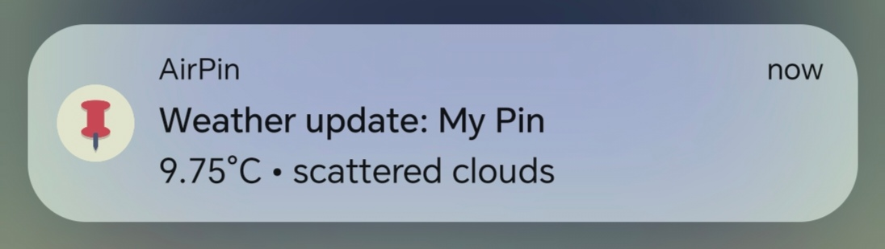

# Android WorkManager⚙️
## 1. Utemeljitev izbire tehnologije

Tehnologija Android WorkManager je izbrana, saj predstavlja 
primerno in splošno uporabno rešitev za izvajanje periodičnih in ponavljajočih 
se opravil v Android aplikacijah. WorkManager omogoča zanesljivo izvajanje nalog 
ne glede na stanje aplikacije ali naprave, kar je pri mobilnih aplikacijah zelo pomembno.

Opravila se lahko izvajajo tudi v primerih, ko:
- aplikacija ni zagnana,
- aplikacija deluje v ozadju,
- uporabnik zapre aplikacijo,
- se mobilna naprava ponovno zažene,
- je naprava v stanju varčevanja z energijo (Doze mode).

Tehnologija je primerna za naloge, kot so periodično pridobivanje podatkov,
sinhronizacija z omrežjem in pošiljanje obvestil. Ob tem WorkManager upošteva
omejitve sistema Android glede porabe baterije in izvajanja v ozadju ter
samodejno prilagaja način izvajanja nalog glede na različico operacijskega
sistema.


## Prednosti
- ***Zanesljivost*** – opravila se izvajajo tudi v primeru, ko aplikacija ni aktivna
  ali ko je naprava ponovno zagnana.
- ***Skladnost s sistemom Android*** – deluje v skladu s pravili operacijskega sistema Android in ne poskuša zaobiti njegovih omejitev.
- ***Nadzor nad pogoji izvajanja*** – razvijalcu omogoča določanje pogojev, pod
  katerimi se opravila izvedejo, na primer ob dostopu do interneta ali
  ustreznem stanju baterije.
- ***Univerzalnost*** – omogoča enotno uporabo na različnih različicah
  operacijskega sistema Android.
- ***Praktičnost*** – poenostavi razvoj, saj ni potrebno ročno upravljanje
  različnih sistemskih mehanizmov za izvajanje opravil v ozadju.

## Slabosti
- ***Minimalni časovni interval*** – najmanjši možni interval za periodična
  opravila je 15 minut, kar je posledica sistemskih omejitev Androida.
- ***Nenatančno časovno izvajanje*** – WorkManager ni primeren za naloge, ki
  zahtevajo natančen ali realnočasovni zagon, saj sistem določa točen čas
  izvajanja.
- ***Večja kompleksnost implementacije*** – v primerjavi z enostavnimi
  časovniki zahteva nekoliko več kode in razumevanja, vendar zagotavlja
  večjo zanesljivost.

  
## Licenca
WorkManager je odprtokodna knjižnica, ki je izdana pod licenco Apache License 2.0.


## Število uporabnikov
Natančnega števila uporabnikov knjižnice WorkManager ni mogoče določiti,
saj gre za razvojno knjižnico. 

Na podlagi dejstva, da je WorkManager del Android Jetpacka in uradno 
priporočena rešitev podjetja Google, lahko ocenimo, da se uporablja 
v zelo velikem številu Android aplikacij po vsem svetu, predvsem v
produkcijskih okoljih.


## Časovna in prostorska zahtevnost
WorkManager sam po sebi ne predstavlja večjih časovnih ali prostorskih
obremenitev. Časovna zahtevnost je predvsem odvisna od dejanskega opravila,
ki ga WorkManager razporeja in izvaja, saj knjižnica sama ne izvaja logike,
temveč skrbi za zanesljivo načrtovanje in izvajanje nalog.

Poraba sistemskih virov je odvisna od vsebine opravila, ki se izvaja v
ozadju. Opravila se izvajajo asinhrono in zato ne vplivajo neposredno na
odzivnost uporabniškega vmesnika.

## Vzdrževanje tehnologije
WorkManager razvija in vzdržuje podjetje Google kot del Android Jetpack
ekosistema. Knjižnica je aktivno vzdrževana, redno posodobljena in ima
veliko skupnost razvijalcev. Zadnje spremembe so objavljene skupaj z
ostalimi posodobitvami Android Jetpack komponent.

## 2. Demo primer
V okviru drugega dela naloge je bila izdelana preprosta demo Android
aplikacija, katere namen je prikaz osnovne uporabe knjižnice WorkManager.

Aplikacija vsebuje en sam zaslon z gumbom, ki ob kliku zažene opravilo v
ozadju. Opravilo se izvede z uporabo OneTimeWorkRequest z začetno zakasnitvijo,
kar omogoča jasen prikaz izvajanja opravila tudi takrat, ko aplikacija ni več
aktivna.

### Primer kode - klasa myWorker:
```kotlin
class MyWorker(
    private val context: Context,
    workerParams: WorkerParameters
) : CoroutineWorker(context, workerParams) {

    override suspend fun doWork(): Result {
        return try {
            delay(3000)
            showNotification()
            Result.success()
        } catch (e: Exception) {
            Result.failure()
        }
    }
}
```
### Zagon opravila:
```kotlin
val workRequest =
    OneTimeWorkRequestBuilder<MyWorker>()
        .setInitialDelay(10, TimeUnit.SECONDS)
        .build()

WorkManager.getInstance(this)
    .enqueue(workRequest)

```

### Video prikaz delovanja


## 3. Uporaba v lastnem projektu (AirPin)

Knjižnica WorkManager je uporabljena tudi v lastnem projektu AirPin, kjer
služi za periodično pridobivanje vremenskih podatkov iz zunanjega API-ja
(OpenWeather API) in za pošiljanje obvestil uporabniku.

V aplikaciji je implementiran poseben razred ***WeatherWorker***, ki razširja
CoroutineWorker in vsebuje logiko za pridobivanje podatkov iz API-ja ter
prikaz sistemskega obvestila z vremenskimi informacijami.

### Zaslonska slika - primer delovanja


